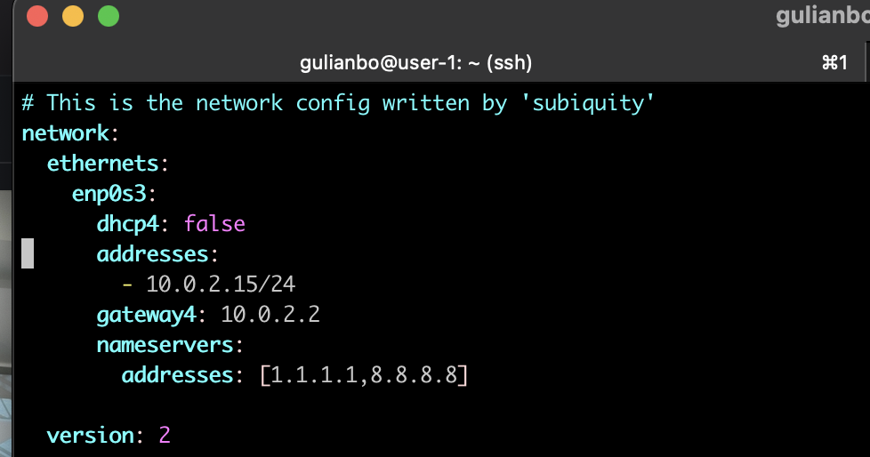
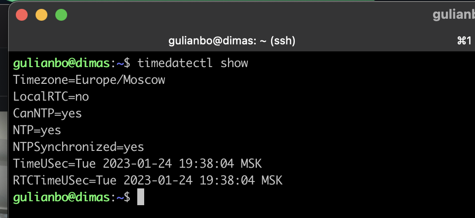

## Part 1. Установка ОС

> Узнайть версию Ubuntu можно, выполнив команду

```bash
cat /etc/issue
```


## Part 2. Создание пользователя

Для создания пользователя 'user1' выполнить команду

```bash
sudo useradd -G adm user1
```

or

```bash
sudo useradd user1
sudo usermod -a -G adm user1
```

  -G аргумент позволяет внести учетную запись в соответствующую группу для работы с определенными данными.

* *adm* — разрешение на прочтение логов из папки  */var/log*;
* *cdrom* — позволяется использовать привод;
* *wheel* — возможность использовать команду *sudo* для предоставления доступа к определенным задачам;
* *plugdev* — разрешение на монтирование внешних накопителей;
* *video, audio* — доступ к аудио и видеодрайверам.

*-s аргумент задает используемую оболочку.*

Новый пользователь должен быть в выводе команды (последняя строка)

```bash
cat /etc/passwd
```


Ps. Удалить user1 `sudo userdel -r -f  user1`

[Создание пользовател](https://lumpics.ru/how-to-create-user-in-ubuntu/)

[Удаление пользователя](https://losst.pro/kak-udalit-polzovatelya-linux)

[Сменить пользователя](https://lumpics.ru/how-to-change-user-in-linux/)

## Part 3. Настройка сети ОС

##### 1.Задать название машины вида user-1

```bash
sudo hostnamectl set-hostname user-1
```


```bash
reboot
```


### 2.Установить временную зону, соответствующую вашему текущему местоположению.

```bash
sudo timedatectl set-timezone Europe/Moscow
```


### 3.Вывести названия сетевых интерфейсов с помощью консольной команды

```bash
ip -br link show
```


1) 0.0.0.0/8 — диапазон адресов, используемый хостами для самоидентификации. Обычно это можно увидеть, когда хост пытается получить IP-адрес от DHCP сервера. Так как изначально у него нету IP-адреса, то в поле источника он вставляет адрес из данного диапазона.
2) 127.0.0.0/8 — loopback или localhost адреса. Это IP-адреса, используемые компьютером, чтобы обратиться к самому себе. Очень полезно для проверки работы TCP/IP. Дело в том, что независимо от наличия соединения с Интернетом или локальной сетью, адреса из этого пула должны всегда пинговаться. Если этого не происходит, значит система накрылась или накрывается медным тазом.
3) 169.254.0.0/16 — link-local address или локальные адреса. Автоматически используются хостами при отсутствии DHCP-сервера или его недоступности. Это позволяет быстро организовать локальную сеть и проверить работу узлов. Однако данный пул адресов не маршрутизируется. Следовательно, выйти в Интернет с них не получится.
4) 224.0.0.0/4 — блок адресов, зарезервированный под многоадресную рассылку или multicast. [(ссылка)](https://tools.ietf.org/html/rfc3171).

### 4. Используя консольную команду получить ip адрес устройства, на котором вы работаете, от DHCP сервера.

```bash
hostname -I
```

or

```bash
ip address
```


IP adress: 10.0.2.15/24

DHCP - Dynamic Host Configuration Protocol. Это протокол прикладного уровня, который помогает назначать IP-адреса устройствам при подключении к серверу. Протокол DHCP автоматизирует выдачу адресов, а также их передачу следующим пользователям после отключения устройств или их перехода из одной подсети в другую. Протокол динамического присвоения IP-адресов функционирует по принципу DORA. **DORA** – это аббревиатура, которая обозначает названия этапов работы протокола DHCP:

* **D** – Discovery (обнаружение);
* **O** – Offer (предложение);
* **R** – Request (запрос);
* **A** – Acknowledge (подтверждение).

### 5. Определить и вывести на экран внешний ip-адрес шлюза (ip) и внутренний IP-адрес шлюза, он же ip-адрес по умолчанию (gw).

Для опередления внешнего шлюза

```bash
 wget -qO- eth0.me
```

Для определения внутреннего шлюза

```bash
ip r | grep default
```


### 6. Задать статичные (заданные вручную, а не полученные от DHCP сервера) настройки ip, gw, dns (использовать публичный DNS серверы, например 1.1.1.1 или 8.8.8.8).

 Отредактировать файл конфигурации **netplan** который находится в директории `/etc/netplan/`

```bash
vim /etc/netplan/00-installer-config.yaml
```

поменять dhcp4 -> false

добавить:

* adresses:
* gateway:
* nameservers:
  * adresses:

Для выхода wq!



 Для применения изменений

```bash
sudo netplan apply
```

И перезагрузка VirtualBox

```bash
reboot
```

После повторяем дял првоерки `vim /etc/netplan/00-installer-config.yaml`


### 7.Пингуем сервера 1.1.1.1, 8.8.8.8, ya.ru. Чтобы ограничить количество пересылаемых пакетов используем команду:

```
 ping -c 3 ya.ru
```

```
 ping -c 3 1.1.1.1
```

```
 ping -c 3 8.8.8.8
```


[PING](https://losst.pro/komanda-ping-v-linux)

[NETPLAN]()

## Part 4. Обновление ОС

Для обновления используем команды

```
sudo apt update
sudo apt upgrade
```


После чего прописываем

```bash
sudo do-release-upgrade
```


P.s пришлось руками проставить обновление у этого пакета

```bash
sudo apt-get install update-notifier-common
```

после этого проверяем `sudo apt update`


## Part 5. Использование команды **sudo**

Поменять hostname ОС от имени пользователя, созданного в пункте [Part 2](#part-2-%D1%81%D0%BE%D0%B7%D0%B4%D0%B0%D0%BD%D0%B8%D0%B5-%D0%BF%D0%BE%D0%BB%D1%8C%D0%B7%D0%BE%D0%B2%D0%B0%D1%82%D0%B5%D0%BB%D1%8F) (используя sudo).

Для лобавления sudo прав используем след команду

```bash
sudo usermod -aG sudo user1
```

Для проверки его прав

```bash
id user1
```


для перехода на другого пользоваетя исрользуем

```bash
su user1
```

Для проверки и изменения  названия машины прописываем

```bash
sudo hostnamectl && sudo hostnamectl set-hostname dimas
```

[Тык](https://wiki.merionet.ru/servernye-resheniya/88/kak-ispolzovat-komandu-sudo-v-linux/)


```bash
reboot
```


sudo команда, которая позволяет вам запускать программы от имени других пользователей, а также от имени суперпользователя. (менять пароль пользователя не зная пароль пользователя)

## Part 6. Установка и настройка службы времени

Для включения сервиса синхронизации команда

```bash
sudo timedatectl set-ntp yes
```


```bash
timedatectl show
```



## Part 7. Установка и использование текстовых редакторов

```bash
sudo apt install vim nano joe
```

### VIM


Для выхода ":wq""

### Nano


Для выхода:

Ctrl + X

Y - сохранить изменения

Enter - утвердить

### Joe


Ctrl + K + D to save

Ctrl + K +  X to leave

### Part 2

### VIM

Для выхода без сохранения ":q!"


### Nano


Ctrl + X - выход

N - не сохранять

### Joe

Ctrl + K + Q - выход

n - не сохранять


### Part 3

### VIM

Для посика ввести /


Для  замены ввести:

```
:s%/patter1/pattern2/flags
```


### NAno

To find use

1.Ctrl + W

2.write a pattern (garri)

3.Enter


To find and replace

1. Ctrl + \
2. Write a pattern (garri)
3. Enter
4. Write pattern1
5. A  - все совпадения


### Joe

to find

1. Ctrl  + K + F
2. i


to edit

1. Ctrl  + K + F
2. ra
3. Enter


## Part 8. Установка и базовая настройка сервиса **SSHD**

```bash
sudo apt install openssh-server &&  sudo systemctl enable sshd
```


Подключение через терминал осуществить можно через

```bash
 ssh localhost
```

Все настройки сервера SSH хранятся в конфигурационном файле sshd_config, который находится в папке /etc/ssh.

Для конфигурации

```bash
 sudo vim /etc/ssh/sshd_config
```


Рестарт службы

```bash
sudo systemctl restart sshd
```

Удаление

```bash
sudo apt-get remove --purge openssh-server
```

  Команда ps

* **-A, -e, (a)** - выбрать все процессы;
* **-a** - выбрать все процессы, кроме фоновых;
* **-d, (g)** - выбрать все процессы, даже фоновые, кроме процессов сессий;
* **-N** - выбрать все процессы кроме указанных;
* **-С** - выбирать процессы по имени команды;
* **-G** - выбрать процессы по ID группы;
* **-p, (p)** - выбрать процессы PID;
* **--ppid** - выбрать процессы по PID родительского процесса;
* **-s** - выбрать процессы по ID сессии;
* **-t, (t) ** - выбрать процессы по tty;
* **-u, (U)** - выбрать процессы пользователя.

Опции форматирования:

* **-с** - отображать информацию планировщика;
* **-f** - вывести максимум доступных данных, например, количество потоков;
* **-F** - аналогично -f, только выводит ещё больше данных;
* **-l** - длинный формат вывода;
* **-j, (j)** - вывести процессы в стиле Jobs, минимум информации;
* **-M, (Z)** - добавить информацию о безопасности;
* **-o, (o)** - позволяет определить свой формат вывода;
* **--sort, (k)** - выполнять сортировку по указанной колонке;
* **-L, (H)** - отображать потоки процессов в колонках LWP и NLWP;
* **-m, (m)** - вывести потоки после процесса;
* **-V, (V)** - вывести информацию о версии;
* **-H** - отображать дерево процессов;

  ```bash
  ps -A | grep ssh
  ```


```bash
 netstat -tan 
```


-t (--tcp) отображает соедниеня только по tcp

-a (--all) вывод всех активных подключений TCP

-n (--numeric) вывод активных подключений TCP с отображением адресов и номеров портов в числовом формате

Proto: Название протокола (протокол TCP или протокол UDP);

recv-Q: очередь получения сети

send-Q: Сетевая очередь отправки

Local Address адрес локального компьтера и используемый номер порта

Foreign Address адрес и номер удаленного компьтера к которому подключен сокет

State состояние сокета

0.0.0.0 означает IP-адрес на локальной машине

## Part 9. Установка и использование утилит  **top** , **htop**

Запуск

```bash
top
```

uptime 2:08

количество авторизованных пользователей 2

общую загрузку системы 0.07, 0.02, 0.00

общее количество процессов 102

загрузку cpu 0.3

загрузку памяти 205.1

pid процесса занимающего больше всего памяти 650 (3.7)

pid процесса, занимающего больше всего процессорного времени 6649 (0.3)


```bash
sudo apt  install htop
```

PID


percent_CPU


pecent_mem


TiMe


Фильтрация по sshd


поиск syslog


Добавлено hostname uptime clock


## Part 10. Использование утилиты

```bash
sudo fdisk --lis
```


В отчёте написать название жесткого диска-

 его размер - 10 Gb

 количество секторов - 20971520

```bash
swapon --show
free -m -h
```


размер swap - 1.4 Gb.

## Part 11. Использование утилиты **df**

```bash
df
```

 отчёте написать для корневого раздела (/):

* размер раздела 8408452 килобайт.
* размер занятого пространства 5174992 килобайт.
* размер свободного пространства 2784744 килобайт.
* процент использования 66%.


* **-a, --all** - отобразить все файловые системы, в том числе виртуальные, псевдо и недоступные;
* **-B** - изменить размер одного блока перед выводом данных, например, можно использовать BM, чтобы вывести все данные в мегабайтах;
* **-h** - выводить размеры в читаемом виде, в мегабайтах или гигабайтах;
* **-H** - выводить все размеры в гигабайтах;
* **-i** - выводить информацию об inode;
* **-k** - выводить размеры в килобайтах;
* **--output** - использовать специальный формат вывода, если не задано, выводит все поля. Доступны такие варианты: 'source', 'fstype', 'itotal', 'iused', 'iavail', 'ipcent', 'size', 'used', 'avail', 'pcent', 'file' и 'target';
* **-P** - использовать формат вывода POSIX;
* **--total** - выводить всю информацию про использованное и доступное место;
* **-t, --type** - выводить информацию только про указанные файловые системы;
* **-x** - выводить информацию обо всех, кроме указанных файловых систем;
  -T  - Она отобразит тип файловой системы;

  
* * размер раздела - 8.1 G
  * размер занятого пространства 5 G
  * размер свободного пространства 2.7 G
  * процент использования 66%
* тип файловой системы для раздела - ext4.

## Part 12. Использование утилиты **du**

Вывести размер папок /home, /var, /var/log (в байтах, в человекочитаемом виде)

```
sudo du -h /var | tail -1 && sudo du -h /home | tail -1 && sudo du -h /var/log | tail -1
```

##### Вывести размер всего содержимого в /var/log (не общее, а каждого вложенного элемента, используя *)

```bash
du -h /var/log/*
```


## Part 13. Установка и использование утилиты **ncdu**

```bash
sudo apt install ncdu
```


```bash
ncdu -x /
```

Чтобы просканировать всю файловую систему — например, вашу корневую файловую систему, то нужно указать путь — для корня это **/** (слэш). Также пригодиться опция **-x** — она говорит программе не выходить за пределы текущей файловой системы, то есть считать только файлы и директории на том диске, который сканируется. Дело в том, что к корневой файловой системе могут быть смонтированы другие диски — и без этой опцией они также будут посчитаны.


## Part 14. Работа с системными журналами

Открыть для просмотра:

##### 1. /var/log/dmesg

```bash
sudo cat /var/log/dmesg
```


##### 2. /var/log/syslog

```bash
sudo cat /var/log/syslog
```


##### 3. /var/log/auth.log

```bash
sudo cat /var/log/auth.log 
```


* Написать в отчёте время последней успешной авторизации: Jan 25 11:32:19
* имя пользователя: gulianbo
* метод входа в систему LOGIN
* Перезапустить службу SSHd.

```
sudo systemctl restart sshd && sudo cat /var/log/syslog
```


Вставить в отчёт скрин с сообщением о рестарте службы (искать в логах).

1. **/var/log/messages** - содержит глобальные системные логи Linux, в том числе те, которые регистрируются при запуске системы. В этот лог записываются несколько типов сообщений: это почта, cron, различные сервисы, ядро, аутентификация и другие.
2. **/var/log/dmesg** - содержит сообщения, полученные от ядра. Регистрирует много сообщений еще на этапе загрузки, в них отображается информация об аппаратных устройствах, которые инициализируются в процессе загрузки. Можно сказать это еще один лог системы Linux. Количество сообщений в логе ограничено, и когда файл будет переполнен, с каждым новым сообщением старые будут перезаписаны. Вы также можете посмотреть сообщения из этого лога с помощью команды dmseg.
3. **/var/log/auth.log** - содержит информацию об авторизации пользователей в системе, включая пользовательские логины и механизмы аутентификации, которые были использованы.
4. **/var/log/boot.log** - Содержит информацию, которая регистрируется при загрузке системы.
5. **/var/log/daemon.log** - Включает сообщения от различных фоновых демонов
6. **/var/log/kern.log** - Тоже содержит сообщения от ядра, полезны при устранении ошибок пользовательских модулей, встроенных в ядро.
7. **/var/log/lastlog** - Отображает информацию о последней сессии всех пользователей. Это нетекстовый файл, для его просмотра необходимо использовать команду lastlog.
8. **/var/log/maillog /var/log/mail.log** - журналы сервера электронной почты, запущенного в системе.
9. **/var/log/user.log** - Информация из всех журналов на уровне пользователей.
10. **/var/log/Xorg.x.log** - Лог сообщений Х сервера.
11. **/var/log/alternatives.log** - Информация о работе программы update-alternatives. Это символические ссылки на команды или библиотеки по умолчанию.
12. **/var/log/btmp** - лог файл Linux содержит информацию о неудачных попытках входа. Для просмотра файла удобно использовать команду last -f /var/log/btmp
13. **/var/log/cups** - Все сообщения, связанные с печатью и принтерами.
14. **/var/log/anaconda.log** - все сообщения, зарегистрированные при установке сохраняются в этом файле
15. **/var/log/yum.log** - регистрирует всю информацию об установке пакетов с помощью Yum.
16. **/var/log/cron** - Всякий раз когда демон Cron запускает выполнения программы, он записывает отчет и сообщения самой программы в этом файле.
17. **/var/log/secure** - содержит информацию, относящуюся к аутентификации и авторизации. Например, SSHd регистрирует здесь все, в том числе неудачные попытки входа в систему.
18. **/var/log/wtmp или /var/log/utmp -** системные логи Linux**, **содержат журнал входов пользователей в систему. С помощью команды wtmp вы можете узнать кто и когда вошел в систему.
19. **/var/log/faillog** - лог системы linux, содержит неудачные попытки входа в систему. Используйте команду faillog, чтобы отобразить содержимое этого файла.
20. **/var/log/mysqld.log** - файлы логов Linux от сервера баз данных MySQL.
21. **/var/log/httpd/ или /var/log/apache2** - лог файлы linux11 веб-сервера Apache. Логи доступа находятся в файле access_log, а ошибок в error_log
22. **/var/log/lighttpd/** - логи linux веб-сервера lighttpd
23. **/var/log/conman/** - файлы логов клиента ConMan,
24. **/var/log/mail/** - в этом каталоге содержатся дополнительные логи почтового сервера
25. **/var/log/prelink/** - Программа Prelink связывает библиотеки и исполняемые файлы, чтобы ускорить процесс их загрузки. /var/log/prelink/prelink.log содержит информацию о .so файлах, которые были изменены программой.
26. **/var/log/audit/** - Содержит информацию, созданную демоном аудита auditd.
27. **/var/log/setroubleshoot/ -** SE Linux использует демон setroubleshootd (SE Trouble Shoot Daemon) для уведомления о проблемах с безопасностью. В этом журнале находятся сообщения этой программы.
28. **/var/log/samba/** - содержит информацию и журналы файлового сервера Samba, который используется для подключения к общим папкам Windows.
29. **/var/log/sa/** - Содержит .cap файлы, собранные пакетом Sysstat.
30. **/var/log/sssd/** - Используется системным демоном безопасности, который управляет удаленным доступом к каталогам и механизмами аутентификации.

## Part 15. Использование планировщика заданий **CRON**

##### uptime

Для задания

```bash
crontab -e
```


Для получения списка задач хрона

```bash
sudo crontab -l
```


```bash
sudo crontab -r
```
