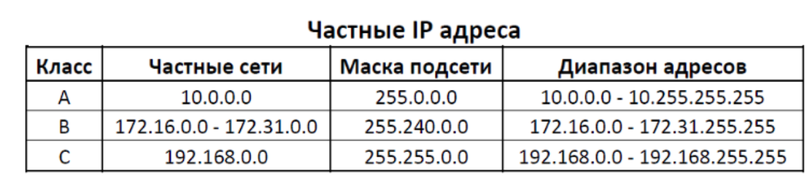
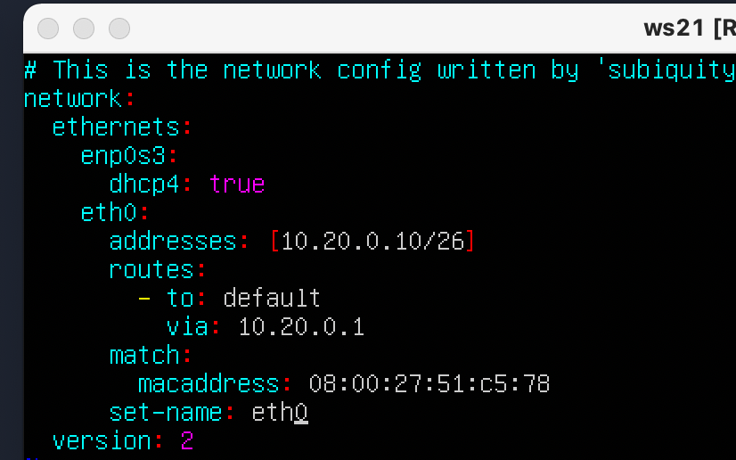
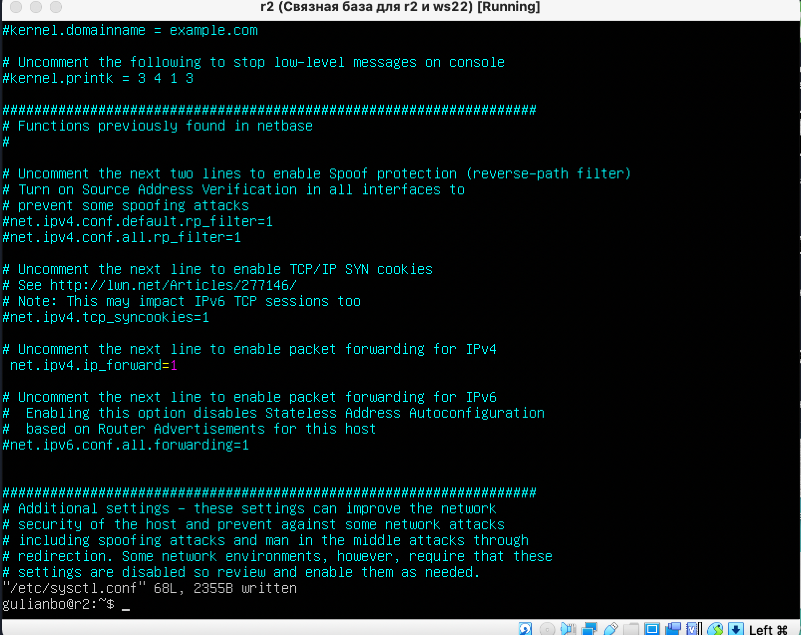
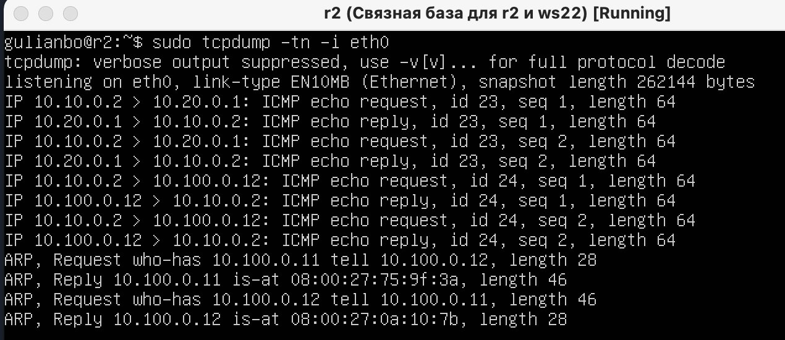
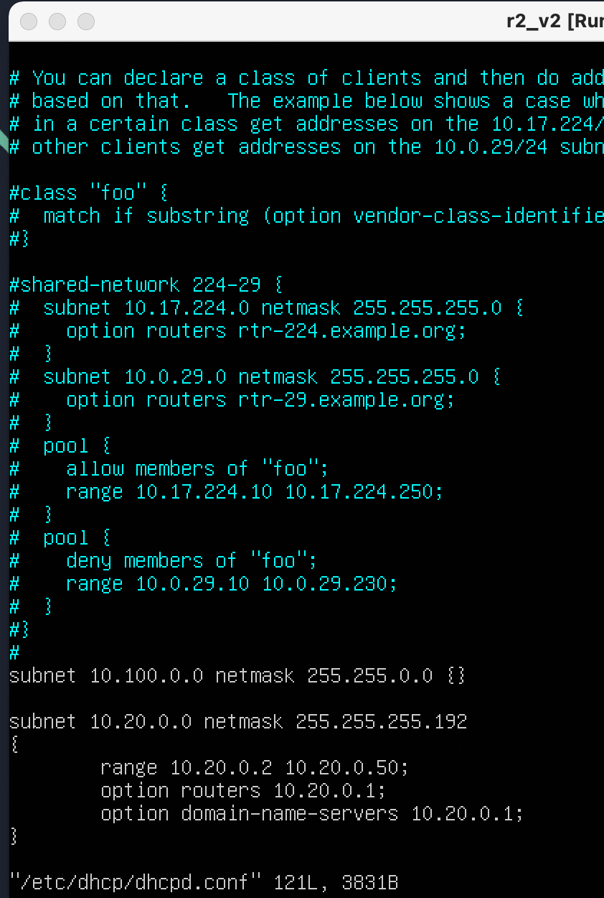
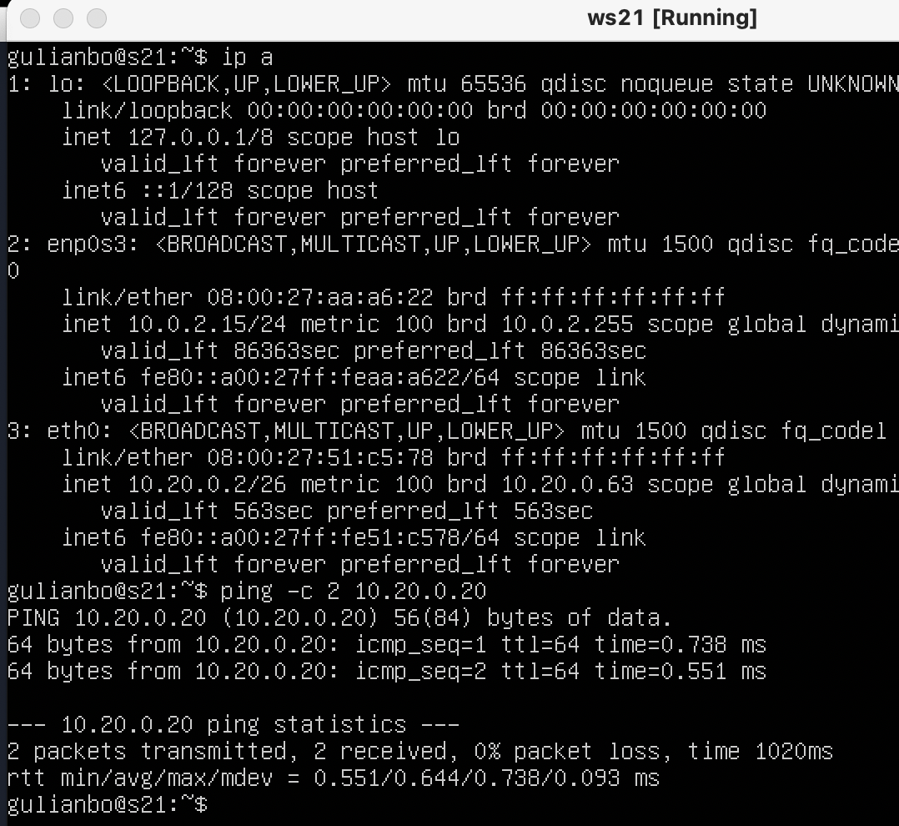

## Part 1. Инструмент **ipcalc**

```bash
sudo apt install ipcalc
```

#### 1.1. Сети и маски

1) Адрес сети *192.167.38.54/13=> Network:   192.160.0.0/13

   

---

2) Перевод маски *255.255.255.0*

   в префиксную /24

   и двоичную запись 11111111.11111111.11111111. 00000000


---

 */15

обычную 255.254.0.0

двоичную  11111111.1111111 0.00000000.00000000


---

*11111111.11111111.11111111.11110000*

в обычную 255.255.255.240

префиксную /28


3) Минимальный и максимальный хост в сети *12.167.38.4*

при масках: */8*

HostMin:   12.0.0.1
HostMax:   12.255.255.254
Broadcast: 12.255.255.255


*11111111.11111111.00000000.00000000*

HostMin:   12.167.0.1
HostMax:   12.167.255.254
Broadcast: 12.167.255.255


*255.255.254.0*

HostMin:   12.167.38.1
HostMax:   12.167.39.254
Broadcast: 12.167.39.255


 */4*

HostMin:   0.0.0.1
HostMax:   15.255.255.254
Broadcast: 15.255.255.255


#### 1.2. localhost

```
ip address

```


Ip localhost = 127.0.0.1/8


Определить и записать в отчёт, можно ли обратиться к приложению, работающему на localhost, со следующими IP:

*194.34.23.100 нет*

*127.0.0.2 да*

*127.1.0.1 да*

*128.0.0.1 нет*

#### 1.3. Диапазоны и сегменты сетей

какие из перечисленных IP можно использовать в качестве публичного, а какие только в качестве частных:



|       Ip       |        res        |
| :------------: | :----------------: |
|   10.0.0.45   |   частный   |
|   134.43.0.2   | публичный |
|  192.168.4.2  |   частный   |
|  172.20.250.4  |   частный   |
|   172.0.2.1   | публичный |
|  192.172.0.1  | публичный |
|   172.68.0.2   | публичный |
| 172.16.255.255 |   частный   |
|  10.10.10.10  |   частный   |
| 192.169.168.1 | публичный |

3) какие из перечисленных IP адресов шлюза возможны у сети *10.10.0.0/18*:

Шлюз - это тот же хост, но имеющий соединение с двумя и более сетями, который может передавать информацию между сетями и направлять пакеты в другую сеть.Шлюз - это тот же хост, но имеющий соединение с двумя и более сетями, который может передавать информацию между сетями и направлять пакеты в другую сеть.


*10.0.0.1 - нет*

*10.10.0.2 - да*

*10.10.10.1 - да*

*10.10.100.1 - нет*

*10.10.1.255 - да*

## Part 2. Статическая маршрутизация между двумя машинами

```bash
ip a
```


Клон


Описать сетевой интерфейс, соответствующий внутренней сети, на обеих машинах и задать следующие адреса и маски: ws1 - *192.168.100.10*, маска */16*, ws2 - *172.24.116.8*, маска */12*


 

Выполнить команду `netplan apply` для перезапуска сервиса сети


#### 2.1. Добавление статического маршрута вручную

###### Добавить статический маршрут от одной машины до другой и обратно при помощи команды вида `ip r add`

```bash
sudo ip r add 172.24.116.8 dev enp0s8
```


```bash
sudo ip r add 192.168.100.10 dev enp0s8
```


Пинг между ними


##### 2.2. Добавление статического маршрута с сохранением


## Part 3. Утилита **iperf3**

```bash
sudo apt install iperf3
```

#### 3.1. Скорость соединения

##### Перевести и записать в отчёт:

##### 8 Mbps ==  1MB/s

##### 100 MB/s  == 12500 Kbps

##### 1 Gbps ==  125 Mbps

#### 3.2. Утилита **iperf3**

##### Измерить скорость соединения между ws1 и ws2

- В отчёт поместить скрины с вызовом и выводом использованных команд.

  Машина 1

  ```bash
  iperf3 -c 172.24.116.8 -f K
  ```

  
  Машина 2

  ```bash
  iperf3 -s
  ```


Для этого на машину 2 накатываем сервер

 Общие опции программы:

* **-p, --port** - указать порт для сервера или к какому порту надо подключаться;
* **-f, --format** - формат выводимых данных, доступны значения: k,m,g,t,K,M,G,T;
* **-i, --interval** - интервал времени между выводами результата тестирования;
* **-F, --file** - использовать данные из файла вместо генерации случайных данных;
* **-V, --verbose** - вывод максимально подробной информации;
* **-J, --json** - вывод в формате JSON;
* **--logfile** - записывать информацию в лог файл;
* **--forceflush** - очищать историю вывода перед выводом следующего результата тестирования;
* **-v, --version** - версия программы.

Только для серверной части:

* **-D, --daemon** - запустить сервер в фоновом режиме;
* **-I, --pidfile** - путь для записи PID файла процесса;
* **-1, --one-off** - обработать только одно подключение клиента, а затем выйти.

Клиентская часть:

* **--sctp** - использовать SCTP вместо TCP;
* **-u, --udp** - использовать UDP вместо TCP;
* **--connect-timeout** - таймаут для первого соединения с сервером в миллисекундах;
* **-b, --bitrate** - битрейт, для UDP используется по умолчанию 1 Мбит/сек, для TCP не ограничено;
* **-t, --time** - время одного теста в секундах, по умолчанию 10 секунд;
* **-R, --reverse** - обратный тест, не клиент отправляет данные серверу, а сервер клиенту;
* **-P** - количество потоков;
* **-w** - размер окна TCP;
* **-4, --version4** - использовать только IPv4;
* **-6, --version6** - использовать только IPv6.

## Part 4. Сетевой экран

#### 4.1. Утилита **iptables**

##### Создать файл */etc/firewall.sh*, имитирующий фаерволл, на ws1 и ws2:

Firewall на ws1

 


Firewall на ws2


Разница заключается в том что приоритезация инструкций идет с верху в низ.

Т.е. для первой машины приоритет запрета echo reply выше и машина пинговаться не будет


Для второй машины наоборот - приориет echo reply на ответ больше и соотвестенно она будет пинговаться


[Полезно про iptables](https://losst.pro/kak-otkryt-port-ubuntu)

### 4.2. Утилита **nmap**

Машина  ws1 не пингуется

```bash
sudo apt install nmap
```

**nmap опции:**

* **-sL** - просто создать список работающих хостов, но не сканировать порты nmap;
* **-sP** - только проверять доступен ли хост с помощью ping;
* **-PN** - считать все хосты доступными, даже если они не отвечают на ping;
* **-sS/sT/sA/sW/sM** - TCP сканирование;
* **-sU** - UDP сканирование nmap;
* **-sN/sF/sX** - TCP NULL и FIN сканирование;
* **-sC** - запускать скрипт по умолчанию;
* **-sI** - ленивое Indle сканирование;
* **-p** - указать диапазон портов для проверки;
* **-sV** - детальное исследование портов для определения версий служб;
* **-O** - определять операционную систему;
* **-T[0-5]** - скорость сканирования, чем больше, тем быстрее;
* **-D** - маскировать сканирование с помощью фиктивных IP;
* **-S** - изменить свой IP адрес на указанный;
* **-e** - использовать определенный интерфейс;
* **--spoof-mac** - установить свой MAC адрес;
* **-A** - определение операционной системы с помощью скриптов.

Для првоерки используем команду

```
nmap -sP 192.168.100.10
```


Откуда можно сделать вывод что машина ws1 работает, на что указывает утилита nmap, но firewall настроен так, что с машины ws2 он не пингуется.

## Part 5. Статическая маршрутизация сети

### 5.1. Настройка адресов машин

1. ws11


2. r1


3. r2


4. ws22


5. ws21



Ping ws11 && r1


Перезапуск сети

```bash
sudo systemctl restart systemd-networkd
```

ping ws22 && ws21


#### 5.2. Включение переадресации IP-адресов.

Для включения переадресации IP, выполните команду на роутерах:

`sysctl -w net.ipv4.ip_forward=1`


Откройте файл */etc/sysctl.conf* и добавьте в него следующую строку:

r1

/Users/gulianbo/DO2_LinuxNetwork-0/README_RUS.md 

r2

/Users/gulianbo/DO2_LinuxNetwork-0/README_RUS.md 

### 5.3. Установка маршрута по-умолчанию

Настроить маршрут по-умолчанию (шлюз) для рабочих станций. Для этого добавить `default` перед IP роутера в файле конфигураций

Для ws11:


Для ws21:


Для ws22:


Ping ws11 && r2


```bash
tcpdump -tn -i eth1
```



### 5.4. Добавление статических маршрутов

Для r1


r2


```bash
sudo tcpdump -tn -i <port>
```


Запустить команды на ws11:

`ip r list 10.10.0.0/[маска сети]` и `ip r list 0.0.0.0/0`


* Для адреса 10.10.0.0/[маска сети] был выбран маршрут eth0 так как этот Ip вполне мог принадлежать одному из хостов подсети и выход из нее не требуется.
* Для адреса 0.0.0.0/0 был выбран маршрут по умолччанию так как он не принажлежит подсети 10.10.0.0/[18] и, следовательно, идет в шлюз, чтобы через маршрутизаторы найти путь.

### 5.5. Построение списка маршрутизаторов


* Скриншот с вызовом команды `tcpdump` на r1. Так как вывод команды не умещается на один экран, сделал пренаправление в файл:


Принцип работы построения пути при помощи  **traceroute**.

Первоначальный хост, с которого запускается команда, отправляет серию пакетов с TTL = 1. TTL - время жизни пакета, характеризующееся количеством хостов, через которое должен пройти пакет, прежде чем будет удалён.

Первый пакет отправляется с TTL = 1, достигая первого маршрутизатора, он будет уничтожен, и маршрутизатор отправляет ICMP-сообщение: "time exceeded in-transit". Получив подобное сообщение сообщение, traceroute увеличивает ttl следующих пакетов на 1.

Каждый раз отправляется по три пакета и для каждого из них измеряется время прохождения. Пакет отправляется на случайный порт, который, скорее всего, не занят. Когда утилита traceroute получает сообщение от целевого узла о том, что порт недоступен трассировка считается завершенной.

Таким образом он может отследить каждый узел задействованный в передаче пакета от 1 хоста к 2.

#### 5.6. Использование протокола **ICMP** при маршрутизации

##### Запустить на r1 перехват сетевого трафика, проходящего через eth0 с помощью команды:

`tcpdump -n -i eth0 icmp`

##### Пропинговать с ws11 несуществующий IP (например, *10.30.0.111*) с помощью команды:

`ping -c 2 10.30.0.111`

- В отчёт поместить скрин с вызовом и выводом использованных команд.


## Part 6. Динамическая настройка IP с помощью **DHCP**Для r2 настроить в файле */etc/dhcp/dhcpd.conf* конфигурацию службы **DHCP**:

```bash
sudo apt-get install isc-dhcp-server
```

##### 1) указать адрес маршрутизатора по-умолчанию, DNS-сервер и адрес внутренней сети. Пример файла для r2:



2) в файле *resolv.conf* прописать `nameserver 8.8.8.8.`


Перезагрузить службу **DHCP** командой `systemctl restart isc-dhcp-server`. Машину ws21 перезагрузить при помощи `reboot` и через `ip a` показать, что она получила адрес. Также пропинговать ws22 с ws21.


Убираем статическое назанчение IP


```bash
reboot
```

```bash
ip a
```

Ping ws22:



eth0 global dynamic - говорит о наличии динамического IP

P.s. так можно вкл/откл dhcp server enable/disable

```bash
systemctl enable  isc-dhcp-server
```

Указать MAC адрес у ws11, для этого в *etc/netplan/00-installer-config.yaml* надо добавить строки:

`macaddress: 10:10:10:10:10:BA`

`dhcp4: true`


### Для r1 настроить аналогично r2, но сделать выдачу адресов с жесткой привязкой к MAC-адресу (ws11). Провести аналогичные тесты


### Запросить с ws21 обновление ip адреса

До обновления


Для удаления старого ip

```bash
sudo dhclient -r
```

Для обновления

```bash
sudo dhclient -v
```


## Part 7. **NAT**

```bash
sudo apt install apache2
```

##### В файле */etc/apache2/ports.conf* на ws22 и r1 изменить строку `Listen 80` на `Listen 0.0.0.0:80`, то есть сделать сервер Apache2 общедоступным


##### Запустить веб-сервер Apache командой `service apache2 start` на ws22 и r1


##### Добавить в фаервол, созданный по аналогии с фаерволом из Части 4, на r2 следующие правила:

##### 1) Удаление правил в таблице filter - `iptables -F`

##### 2) Удаление правил в таблице "NAT" - `iptables -F -t nat`

##### 3) Отбрасывать все маршрутизируемые пакеты - `iptables --policy FORWARD DROP`


##### Проверить соединение между ws22 и r1 командой `ping`

*При запуске файла с этими правилами, ws22 не должна "пинговаться" с r1*


##### 4) Разрешить маршрутизацию всех пакетов протокола **ICMP**

##### Проверить соединение между ws22 и r1 командой `ping`

*При запуске файла с этими правилами, ws22 должна "пинговаться" с r1*


- 

##### 5) Включить **SNAT**, а именно маскирование всех локальных ip из локальной сети, находящейся за r2 (по обозначениям из Части 5 - сеть 10.20.0.0)

##### 6) Включить **DNAT** на 8080 порт машины r2 и добавить к веб-серверу Apache, запущенному на ws22, доступ извне сети


Ping от ws22 to r1


от r1 до ws22


## Part 8. Дополнительно. Знакомство с **SSH Tunnels**

Запустить веб-сервер **Apache** на ws22 только на localhost (то есть в файле */etc/apache2/ports.conf* изменить строку `Listen 80` на `Listen localhost:80`)

ws2


Воспользоваться *Local TCP forwarding* с ws21 до ws22, чтобы получить доступ к веб-серверу на ws22 с ws21

```bash
sudo ssh -L 8080:localhost:2022 gulianbo@10.20.0.20 -p 2022 
```


У нас создалось новое соединение котрое можно посмотреть в новом терминале через

```
netstat -tan
```


Откуда виддно что создался ssh-tunnel с ws22 через  локальный порт 8080

Для проверки соединения команда

```
telnet 127.0.0.1 8080
```

or

```
telnet localhost 8080
```

где 8080 это наш вновь объявленный порт


Для выхода

```bash
exit 
```

2) Воспользоваться *Remote TCP forwarding* c ws11 до ws22, чтобы получить доступ к веб-серверу на ws22 с ws11

```
sudo ssh -R 2022:localhost:8080 gulianbo@10.10.0.2 -p 2022
```

До команды на ws11


После


и запуск с ws11

```
telent localhost 2022
```

or 

```
telnet 10.10.0.2 2022
```

где 2022 - вновь созданный   порт


