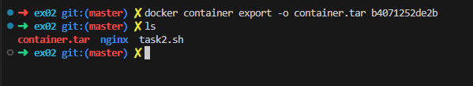
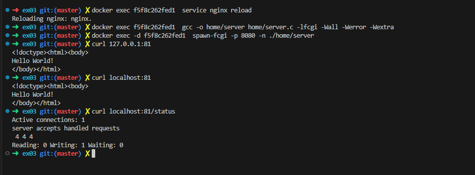

## Part 1. Ready-made docker

1.1 Использование `docker pull` для nginx image


1.2 Запуск докер образа и проверка наличия докер образа и что образ запустился

```
docker run -d [image_id|repository]
docker ps
```


1.3 Посмотреть информацию о контейнере

```
docker inspect --size <container_id|container_name>
```


По выводу команды определить и поместить в отчёт размер контейнера, список замапленных портов и ip контейнера

1.5 Размер

The total size of all the files in the container, in bytes:

```
docker inspect --size <container_id|container_name> -f '{{ .SizeRootFs }}'
```


1.6 Список замапленных портов лежит в блоке NetworkSettings:


1.7 IP контейнера

```
docker inspect <container_id|container_name> | grep -i -e "\"ipaddress\"" | head -1
```


1.8 Остановка контейнера

```
docker stop <container_id|container_name>
```


1.9 Запустить докер с портами 80 и 443 в контейнере, замапленными на такие же порты на локальной машине, через команду *run и проверить, что в браузере по адресу *localhost:80* доступна стартовая страница **nginx***

```
docker run -p 80:80 -p 443:443 -d nginx
```

```
curl localhost:80
```


## Part 2. Operations with container

2.1 Прочитать конфигурационный файл *nginx.conf* внутри докер контейнера через команду *exec*

```
docker exec  <CONTAINER ID> cat /etc/nginx/nginx.conf
```


2.2 Создать на локальной машине файл *nginx.conf*  и Настроить в нем по пути */status* отдачу страницы статуса сервера **nginx**


2.3 Скопировать созданный файл *nginx.conf* внутрь докер образа через команду `docker cp`

```
docker cp ./nginx/nginx.conf <CONTAINER ID>:/etc/nginx/nginx.conf
```


2.4 Перезапустить **nginx** внутри докер образа через команду *exec*

```
docker exec <CONTAINER ID> service nginx reload
```

2.5 Проверить, что по адресу *localhost:80/status* отдается страничка со статусом сервера **nginx**

```
curl 127.0.0.1:80/status
```


2.6 Экспортировать контейнер в файл *container.tar* через команду *export*

```
docker container export -o container.tar <CONTAINER ID>
```



2.7 Остановить контейнер

```
docker stop <CONTAINER ID>
```

2.8 Удалить образ через `docker rmi [image_id|repository]`, не удаляя перед этим контейнеры

```
docker rmi -f <IMAGE ID>
```

2.9 Удалить остановленный контейнер

```
docker rm <CONTAINER ID>
```


2.10 Импортировать контейнер обратно через команду

```
docker import -c 'CMD ["nginx", "-g", "daemon off;"]' -c 'ENTRYPOINT ["/docker-entrypoint.sh"] ' container.tar nginx_v2
```

2.11 Запустить импортированный контейнер

```
docker run -p 80:80 -p 443:443 -d <IMAGE ID>
```


2.12 Проверить, что по адресу *localhost:80/status* отдается страничка со статусом сервера **nginx**

```
curl 127.0.0.1:80/status
```


## Part 3. Mini web server

В Ubuntu или Debian, вы можете установить библиотеку FastCGI с помощью следующей команды:

Установка FastCgi и spawn-fcgi:

```
sudo apt install spawn-fcgi libfcgi-dev
```

3.1 Мини сервер на **C** и **FastCgi**, который будет возвращать простейшую страничку с надписью `Hello World!`

```С
#include <fcgi_stdio.h>
#include <stdlib.h>

int main (void) {
    while (FCGI_Accept() >= 0) {
        printf("Status: 200 OK\r\n");
        printf("Content-type: text/html\r\n\r\n");
        printf("<!doctype><html><body>\nHello World!\n</body></html>\n");
    }
    return EXIT_SUCCESS;
}
```

Компилиция:

```
gcc -o server main.c -lfcgi -Wall -Werror -Wextra
```

Запустить написанный мини сервер через *spawn-fcgi* на порту 8080:

```
spawn-fcgi -p 8080 -n ./server
```

3.2 Написать свой *nginx.conf*, который будет проксировать все запросы с 81 порта на *127.0.0.1:8080*


Поднимать будем на готовом образе nginx

```
docker pull nginx
```

```
docker run -p 81:81 -d nginx
```

```
docker cp nginx/nginx.conf <CONTAINER>:/etc/nginx/nginx.conf
```

```
docker cp server.c <CONTAINER>:/home/
```


```
docker exec <CONTAINER_ID> apt-get update
```

```
docker exec <CONTAINER_ID> apt-get install -y gcc spawn-fcgi libfcgi-dev
```


```
 docker exec <CONTAINER_ID> service nginx reload  
```

```
 docker exec <CONTAINER_ID> gcc -o home/server home/server.c -lfcgi -Wall -Werror -Wextra
```

```
 docker exec <CONTAINER_ID> -d spawn-fcgi -p 8080 -n ./home/server
```

```
curl localhost:81
```

```
curl localhost:81/status
```



## Part 4. Your own docker

4.1 Создание Dockerfile на основе nginx:

```bash
FROM nginx

COPY server.c /home/
COPY nginx/nginx.conf /etc/nginx/
COPY configure.sh /docker-entrypoint.d/
RUN apt-get update -y;\
    apt-get upgrade -y; \
    apt-get install -y gcc spawn-fcgi libfcgi-dev; \
    rm -rf /var/lib/apt/lists/*; \
    gcc -o /home/server /home/server.c -lfcgi -Wall -Werror
CMD ["nginx", "-g", "daemon off;"]
ENTRYPOINT ["/docker-entrypoint.sh"]
```

4.2 Скрипт для конфигурации для запуска сервера на порту 8080

```bash
#!/bin/bash
set -e
spawn-fcgi -p 8080 -n ./home/server &
exit 0
```

4.3 Сборка докер файла с указанием имени и тега

```
docker build . -t <name>:<tag>
```

4.5 Проверить через `docker images`, что все собралось корректно


4.6 Запустить собранный докер образ с маппингом 81 порта на 80 на локальной машине и маппингом папки *./nginx* внутрь контейнера по адресу, где лежат конфигурационные файлы **nginx**'а.

```
docker run  -v ${PWD}/nginx/nginx.conf:/etc/nginx/nginx.conf -p 80:81 -d  my_container:1.0
```


4.7 Дописать в *./nginx/nginx.conf* проксирование странички */status*, по которой надо отдавать статус сервера **nginx**


##### 4.8 Перезапустить докер образ

*Если всё сделано верно, то, после сохранения файла и перезапуска контейнера, конфигурационный файл внутри докер образа должен обновиться самостоятельно без лишних действий*

```bash
docker stop <CONTAINER_ID>
```

поменять nginx.conf

```bash
docker restart <CONRAINER_ID>
```


## Part 5. **Dockle**

Просканировать образ из предыдущего задания через `dockle [image_id|repository]`:

```
dockle [options] image_name:tag
```


Исправленный Dockerfile

```
DOCKER_CONTENT_TRUST=1
```


После ошибок и предупреждений нет

```
docker build . -t my_container:1.0
```

```
dockle -ak NGINX_GPGKEY -ak NGINX_GPGKEY_PATH my_container:1.0
```

```
sudo docker run  -v ${PWD}/nginx/nginx.conf:/etc/nginx/nginx.conf -p 80:81 -d my_container:1.0
```

```
curl localhost:80
curl localhost:80/status
```


## Part 6. Базовый **Docker Compose**

6.1 Контейнер с nginx для проксирования

Dockerfile:


./nginx/nginx.conf:


6.2 Docker-compose c замапленными портами второй машины


6.3 Собрать и запустить проект с помощью команд `docker-compose build` и `docker-compose up`


6.4 Проверить, что в браузере по *localhost:80* отдается написанная вами страничка, как и ранее


