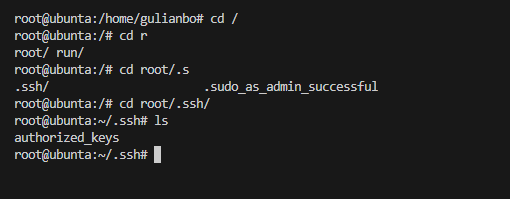

## Part 5. Этап деплоя

Написать bash-скрипт, который при помощи **ssh** и **scp** копирует файлы, полученные после сборки (артефакты), в директорию */usr/local/bin* второй виртуальной машины

```bash
#!/bin/bash
set -e
scp  cat/s21_cat grep/s21_grep \
root@192.168.100.10:/usr/local/bin
```

Для переброса файлов по ssh
зайти на пользователя gitlab-runner

```bash
sudo su gitlab-runner
```

Сгенерировать ssh-ключ и прочитать его

```bash
ssh-keygen
```

```bash
cat /home/gitlab-runner/.ssh/<keyname>.pub
```


Данный ключ необходим на машине для деплоя

На ней необходимо зайти на root и найти authorized_keys

```bash
cd /root/.ssh
```



И вставить туда полученный ключ с нашего хоста


Так же отключить вход на root при помощи ssh по паролю

```bash
vim /etc/ssh/sshd_config
```

И поставить в строке `PasswordAuthentication no`


После перезагрузить службы ssh

```bash
service ssh restart
```

```bash
systemctl restart ssh
```

Теперь заходим на первую машину и пробуем

```bash
ssh root@<ip_machine>
```


Если пароль не спрашвиает, то все верно

Конфиги машин


